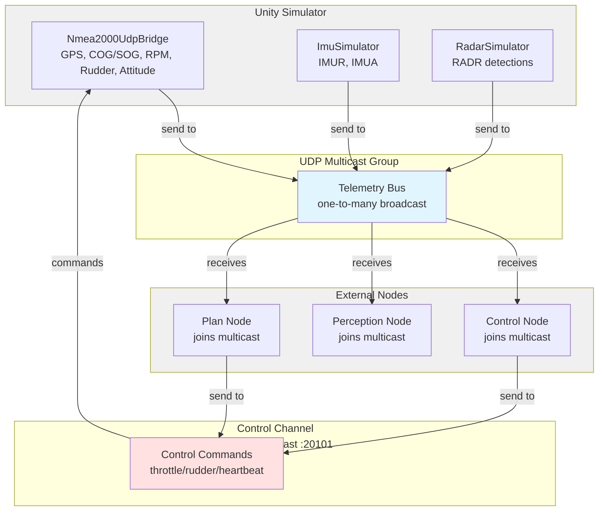

## Messaging overview

- **Telemetry bus (simulated CAN / NMEA2000)**
  - Multicast endpoint `239.10.0.1:20000` (`UdpPublisher.TelemetryEndpoint`).
  - Carries NMEA2000-style PGNs for GPS (0x1F801), COG/SOG (0x1F802), engine RPM (0x1F200), rudder (0x1F10D), attitude (0x1F119) and any future PGNs.
  - Also carries custom sensor frames: `IMUR` (raw IMU), `IMUA` (attitude) and `RADR` (radar detections). Each frame includes a 4-byte ASCII header, 8-byte BE timestamp, then payload floats in big-endian order.
  - Subscribers just join the multicast group to see the entire "bus", mirroring a real CAN/NMEA2000 backbone mapped onto Ethernet.

- **Control channel**
  - UDP unicast port `20101` (`UdpPublisher.ControlListenEndpoint`).
  - Expected PGNs:
    - `0x1FC00` (set throttle, byte[1]=percent).
    - `0x1FC01` (set rudder, int16 centidegrees).
    - `0x1FC02` (heartbeat – empty payload, just indicates control node is alive).
  - `Nmea2000UdpBridge` enters a fail-safe (zeros throttle/steering) if no command or heartbeat arrives within `controlTimeoutSeconds`.

- **Cameras**
  - Remain unchanged: RTSP (`BevRtspStreamer` + ffmpeg) and/or WebRTC (`WebRtcStreamer`) deliver H.264 video. These use their own signaling (RTSP/HTTP) outside the telemetry bus.

## Migration notes

- Per-script UDP address fields have been removed; all telemetry producers now broadcast on the shared multicast endpoint defined in `UdpPublisher`.
- Consumers (control/perception/plan) must bind to the multicast group to receive radar, IMU, and NMEA2000 PGNs.
- Control nodes must target UDP port `20101` and send periodic `0x1FC02` heartbeats alongside throttle/rudder commands to avoid the simulator’s fail-safe.
